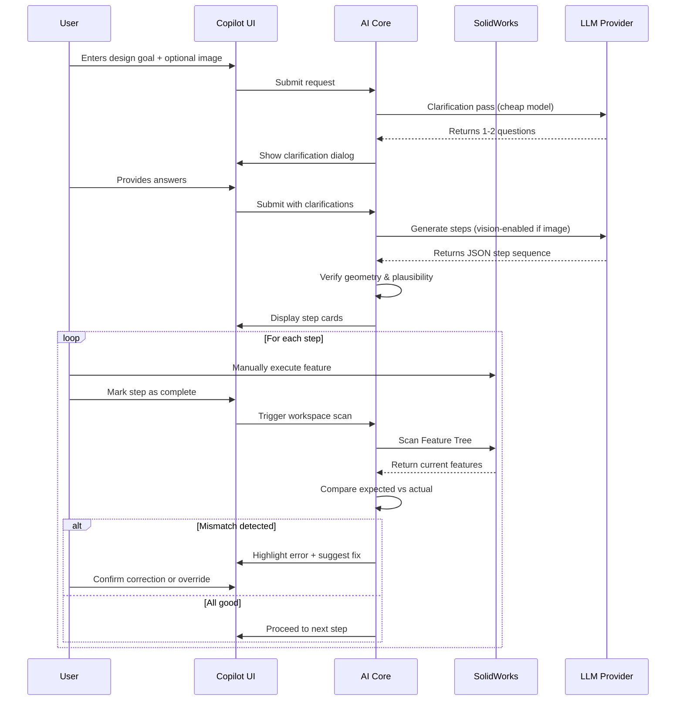

# SolidWorks AI Copilot

[](https://opensource.org/licenses/MIT)
[](https://dotnet.microsoft.com/download/dotnet-framework/net48)
[](https://www.solidworks.com/)

> **An intelligent CAD co-pilot that transforms natural language and reference images into actionable SolidWorks feature sequences — with guided step-by-step execution and real-time verification.**

---

## 🎯 Overview

SolidWorks AI Copilot is a native add-in that integrates large language models (LLMs) directly into your SolidWorks workflow. Unlike automation tools that attempt to control the UI, this copilot acts as an **intelligent guide**: it proposes design steps, you execute them manually, and the system verifies your workspace to catch errors early and adapt subsequent guidance.

### Why This Approach?

| Traditional Automation                      | AI Co-Pilot (This Project)                |
| ------------------------------------------- | ----------------------------------------- |
| ❌ LLM tries to click UI buttons            | ✅ Human executes, AI guides              |
| ❌ No visibility into pop-ups/errors        | ✅ User sees everything, stays in control |
| ❌ One-shot generation = high hallucination | ✅ Iterative refinement with verification |
| ❌ Brittle, breaks on edge cases            | ✅ Robust, learns from user corrections   |
| ❌ Users don't trust black-box automation   | ✅ Transparent, explainable suggestions   |

---

## ✨ Key Features

### Sprint 1 — Conversational Clarification ✅

Before generating steps, the AI asks 1–2 targeted questions to resolve ambiguity:

- _"Is this a sheet metal part or machined solid?"_
- _"What is the approximate overall size (mm)?"_
- _"Are there any standard components (e.g., NEMA motors, bearings)?"_

**Impact:** Baseline accuracy improves from ~60% → ~80%.

### Sprint 2 — Image Attachment ✅

Attach a sketch, photo, or reference image to ground the AI's understanding:

- The vision model extracts proportions, hole patterns, and key features
- Image-derived dimensions take precedence over assumptions
- Contradictions between text and image are flagged for review

### Sprint 3 — Incremental Step Generation _(In Development)_

Shift from one-shot generation to iterative, verified workflows:

1. AI proposes the **next 1–2 logical steps** only
2. User executes steps manually in SolidWorks
3. AI scans the Feature Tree to verify correctness
4. If errors detected → AI diagnoses and adjusts future steps
5. Repeat until design is complete

---

## 🏗️ Architecture

```
┌─────────────────────────────────────────────────────────────────┐
│                     SolidWorks Add-In Host                      │
├─────────────────────────────────────────────────────────────────┤
│  ┌──────────────┐  ┌──────────────┐  ┌──────────────┐           │
│  │ CopilotAddIn │  │   CopilotUI  │  │  TaskPane    │           │
│  │   (COM)      │  │    (WPF)     │  │  Manager     │           │
│  └──────┬───────┘  └──────┬───────┘  └──────┬───────┘           │
│         │                 │                 │                   │
│         └─────────────────┼─────────────────┘                   │
│                           ▼                                     │
│                  ┌─────────────────┐                            │
│                  │  CopilotCore    │                            │
│                  │  (AI Orchestration)                          │
│                  │  - AiClient     │                            │
│                  │  - PromptBuilder│                            │
│                  │  - ResponseParser                            │
│                  └────────┬────────┘                            │
│                           │                                     │
│         ┌─────────────────┼─────────────────┐                   │
│         ▼                 ▼                 ▼                   │
│  ┌─────────────┐  ┌─────────────┐  ┌─────────────────┐          │
│  │CopilotModels│  │Workspace    │  │Session Logger   │          │
│  │(Data Models)│  │Scanner      │  │(JSONL traces)   │          │
│  └─────────────┘  └─────────────┘  └─────────────────┘          │
└─────────────────────────────────────────────────────────────────┘
           │
           ▼
    ┌──────────────┐
    │ LLM Providers│
    │ - Anthropic  │
    │ - OpenAI     │
    │ - OpenRouter │
    └──────────────┘
```

### Project Structure

| Project           | Responsibility                                 | Key Files                                                   |
| ----------------- | ---------------------------------------------- | ----------------------------------------------------------- |
| **CopilotModels** | Shared data contracts, DTOs                    | `Models.cs`, `IWorkspaceScanner.cs`                         |
| **CopilotCore**   | AI communication, prompt engineering, parsing  | `AiClient.cs`, `PromptBuilder.cs`, `ResponseParser.cs`      |
| **CopilotUI**     | WPF task pane, step cards, dialogs             | `MainTaskPane.xaml`, `StepCard.xaml`, `ModifyStepDialog.cs` |
| **CopilotAddIn**  | COM registration, SW event handling, lifecycle | `AddIn.cs`, `WorkspaceScanner.cs`, `TaskPaneManager.cs`     |

---

## 🚀 Getting Started

### Prerequisites

- **SolidWorks 2024 or later** (with API access enabled)
- **.NET Framework 4.8 SDK**
- **Visual Studio 2019/2022** (for development/debugging)
- **API Key** from one of the supported providers:
  - [Anthropic](https://console.anthropic.com/) (Claude models)
  - [OpenAI](https://platform.openai.com/) (GPT-4o, GPT-4o-mini)
  - [OpenRouter](https://openrouter.ai/) (Multi-model gateway)

### Installation

1. **Clone the repository**

   ```bash
   git clone https://github.com/your-org/SolidWorksCopilot.git
   cd SolidWorksCopilot
   ```

2. **Build the solution**

   ```bash
   # Open in Visual Studio and build SolidWorksCopilot.sln
   # Or use MSBuild:
   msbuild SolidWorksCopilot.sln /p:Configuration=Release
   ```

3. **Register the Add-In**
   - The build process automatically registers the COM add-in
   - Alternatively, run as Administrator:
     ```powershell
     regasm /codebase CopilotAddIn.dll
     ```

4. **Launch SolidWorks**
   - The "AI Copilot" task pane appears on the right
   - On first run, you'll be prompted to configure your API key

### Configuration

Click the ⚙️ **Settings** icon in the task pane to configure:

- **API Key**: Your provider's authentication token
- **Provider**: Select Anthropic, OpenAI, or OpenRouter

Configuration is stored in:

```
%APPDATA%\SolidWorksCopilot\config.json
```

---

## 📖 How It Works

### Workflow: From Idea to Verified Model



### The Verification Loop (Sprint 3)

The system implements a **human-in-the-loop** verification cycle:

1. **Propose**: AI generates only the next 1–2 steps (not the entire model)
2. **Execute**: User performs the steps manually in SolidWorks
3. **Scan**: `WorkspaceScanner` reads the Feature Tree via COM API
4. **Verify**: Compare expected features against actual model state
5. **Adapt**:
   - If correct → Generate next batch
   - If wrong → Diagnose root cause, regenerate with corrections

This approach ensures:

- ✅ Early error detection (before compounding mistakes)
- ✅ User maintains full control
- ✅ AI learns from corrections in real-time
- ✅ No blind trust in LLM output

---

## 🔧 Development

### Debugging

Logs are written to:

```
%TEMP%\SW_Copilot_Logs\
```

Key files:

- `lifecycle.txt` — Add-in initialization and teardown
- `session_*.jsonl` — Per-session AI prompts and responses
- `last_crash.txt` — Stack trace if the add-in fails to load

### Extending the System

#### Adding a New LLM Provider

1. Update `AiClient.ConfigureHeaders()` to handle the new provider's auth scheme
2. Add provider-specific request/response parsing in `BuildRequestBody()` and `ParseResponse()`
3. Define model constants for clarification and generation tasks

#### Custom Feature Detection

Extend `WorkspaceScanner.ScanFeatureTree()` to extract additional metadata:

```csharp
// Example: Detect fillet radii
if (feature.GetTypeName2() == "Fillet")
{
    var filletFeature = (FilletFeature)feature.GetSpecificFeature2();
    parameters["radius_mm"] = filletFeature.GetRadiusValue();
}
```

### Running Tests

_(Test framework pending implementation)_

```bash
dotnet test SolidWorksCopilot.sln
```

---

## 🛣️ Roadmap

### Phase 1 — MVP (Current)

| Sprint   | Description                                                   | Status         |
| -------- | ------------------------------------------------------------- | -------------- |
| Sprint 1 | Conversational clarification — cheap pre-pass, targeted Q&A   | ✅ Done        |
| Sprint 2 | Image attachment — attach a sketch or reference photo         | ✅ Done        |
| Sprint 3 | Incremental step generation — review and correct step by step | 🚧 In Progress |

### Phase 2 — Intelligence Upgrade

| Sprint   | Description                                                                 | Status      |
| -------- | --------------------------------------------------------------------------- | ----------- |
| Sprint 4 | Critique pass — second LLM call acts as senior engineer review              | ⏳ Planned  |
| Sprint 5 | Mode B error diagnosis — capture SW failures, diagnose, return ranked fixes | ⏳ Planned  |
| Future   | Domain-specific fine-tuning — teach LLM _how to think about CAD_            | 🔬 Research |

---

## 🤝 Contributing

Contributions are welcome! Please follow these guidelines:

1. **Fork the repository** and create a feature branch
2. **Follow existing code style** (C# conventions, XML docs for public APIs)
3. **Test thoroughly** with real SolidWorks sessions
4. **Submit a PR** with a clear description of changes

### Areas Needing Contribution

- [ ] Unit tests for `PromptBuilder` and `ResponseParser`
- [ ] Integration tests with mocked SolidWorks COM objects
- [ ] Support for additional LLM providers (Azure OpenAI, local models)
- [ ] Enhanced feature tree scanning (extract sketch relations, equations)
- [ ] Multi-language UI support

---

## 🙏 Acknowledgments

- **SolidWorks API** — Dassault Systèmes for the robust COM interface
- **Anthropic** — Claude models for exceptional reasoning capabilities
- **OpenAI** — GPT-4o for vision-language understanding
- **Newtonsoft.Json** — Essential for JSON serialization

---

## 📬 Contact

For questions, bug reports, or feature requests:

- Open an issue on GitHub
- Email: [mohamed.baazaoui.1993@gmail.com]

**Built with ❤️ by engineers, for engineers.**
